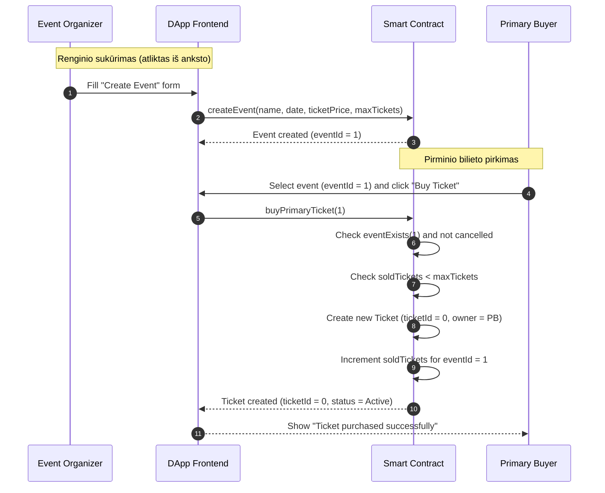
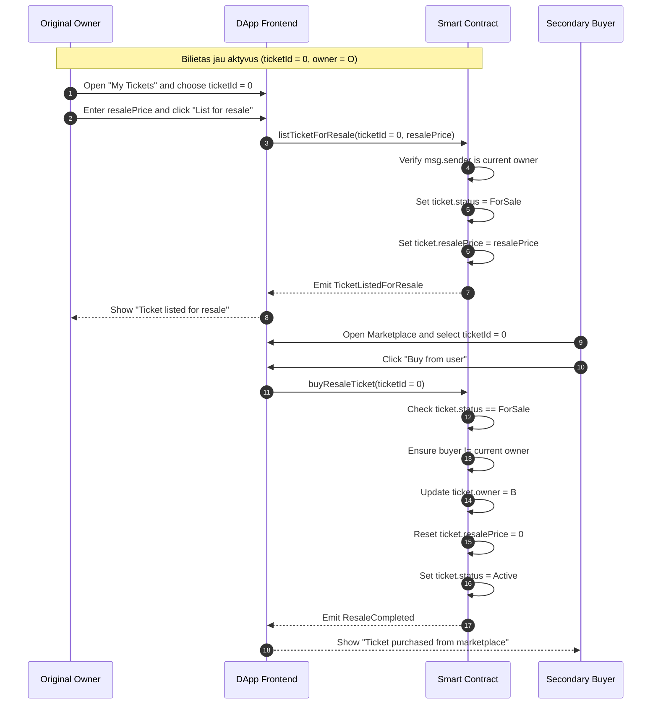
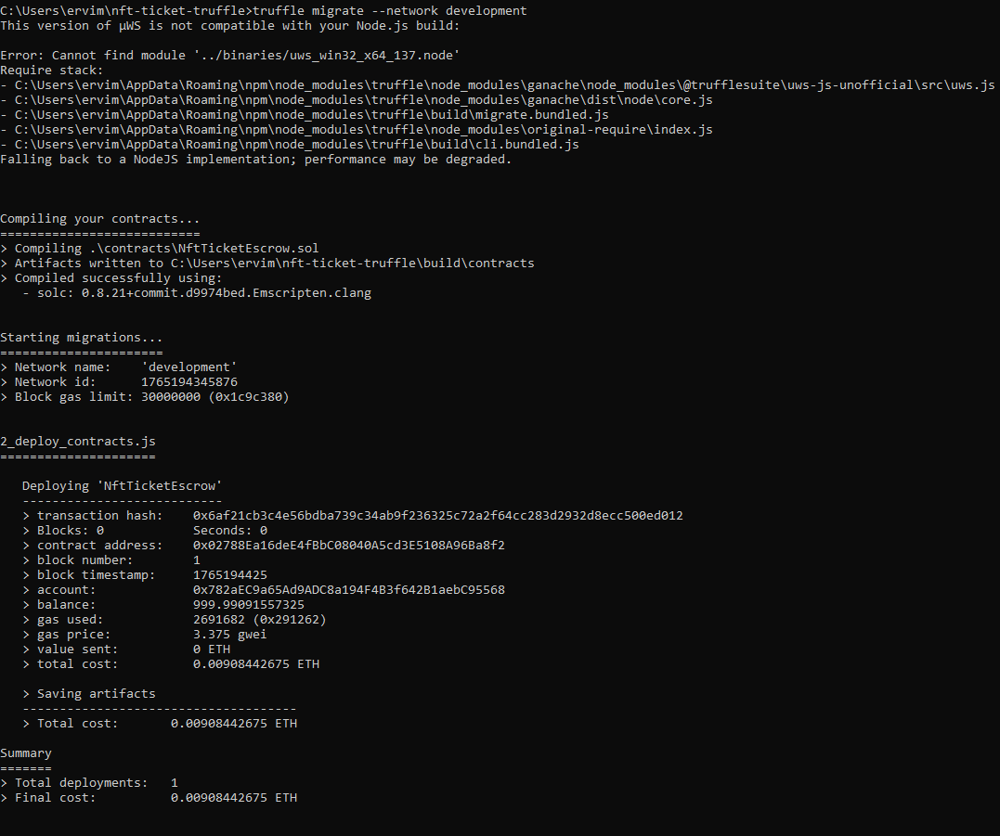
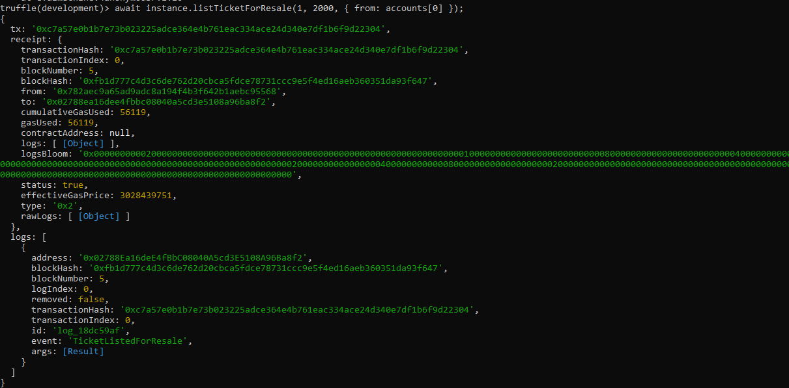
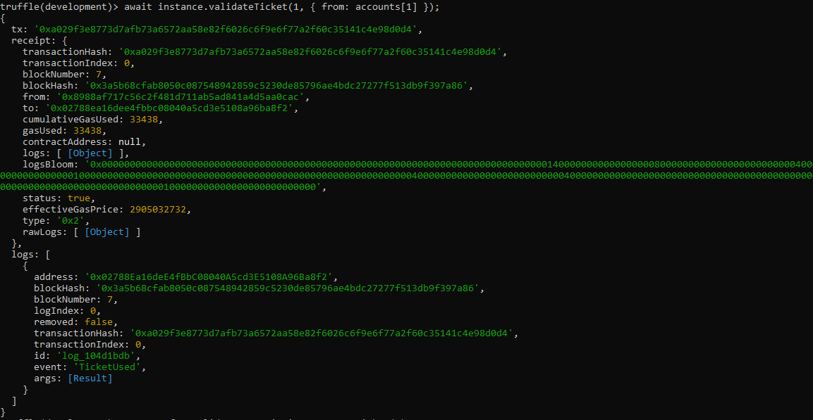
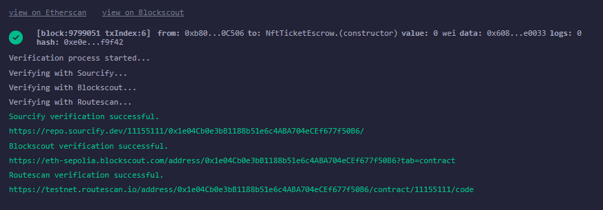
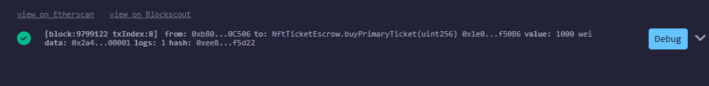
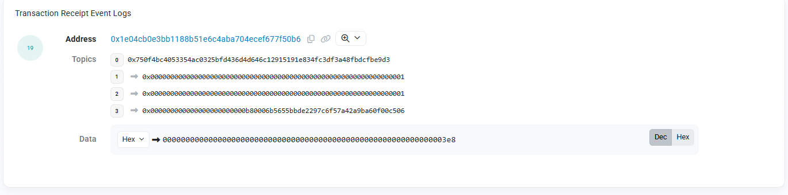

# 3. Verslo modelio ir logikos aprašymas

## 3.1. Verslo modelio esmė

Pasirinktas verslo modelis – **decentralizuota renginių bilietų sistema**, pagrįsta NFT-tipo bilietais ir jų perpardavimu antrinėje rinkoje. Vietoje tradicinės centralizuotos bilietų sistemos (kurioje visą logiką ir duomenis valdo viena įmonė), čia bilietų logika ir būsenos saugomos Ethereum blokų grandinėje, naudojant išmaniąją sutartį parašytą Solidity kalba.

### Bilieto struktūra

Kiekvienas renginio bilietas atvaizduojamas kaip unikalus „ticket" įrašas išmaniojoje sutartyje, turintis:

- unikalų `ticketId`
- nuorodą į konkretų `eventId`
- savininko adresą (`owner`)
- būseną (`status`: aktyvus, parduodamas, panaudotas ir t. t.)
- perpardavimo kainą (`resalePrice`)

### Renginio duomenų struktūra

Renginio duomenys saugomi struktūroje `EventData`, kurioje aprašomas:

- renginio identifikatorius `id`
- organizatoriaus adresas
- pavadinimas
- data
- bilieto kaina (loginė reikšmė `ticketPrice`)
- maksimalus bilietų skaičius
- parduotų bilietų skaičius
- ar renginys atšauktas

### Kainų valdymas

Šioje konkrečioje įgyvendintoje versijoje ETH sumos nėra realiai pervedamos kontrakte, o bilietų kainos (`ticketPrice`, `resalePrice`) saugomos kaip loginiai laukai. Tai leidžia:

- valdyti bilietų būseną
- sekti kainas
- demonstruoti verslo logiką ir dalyvių sąveiką
- o realius atsiskaitymus (jei reikia) atlikti per Front-End (dApp) ir MetaMask sąveiką (pvz., pagal tas pačias kainas)

Toks sprendimas supaprastina kontrakto testavimą ir analizę, bet išlaiko visą verslo modelio logiką: renginio kūrimą, pirminį pirkimą, bilieto perpardavimą ir panaudojimą.

---

## 3.2. Pagrindiniai veikėjai

Verslo modelyje dalyvauja šios pagrindinės šalys:

### 🎭 Renginio organizatorius (Event Organizer)

- Sukuria naujus renginius naudodamas funkciją `createEvent(...)`
- Nustato renginio pavadinimą, datą, loginę bilieto kainą (`ticketPrice`) ir maksimalų bilietų skaičių (`maxTickets`)
- Gali matyti, kiek bilietų jau parduota (`soldTickets`)
- Ateityje (išplėstoje versijoje) galėtų atšaukti renginį ir inicijuoti grąžinimus

### 🎫 Pirminis pirkėjas (Primary Buyer)

- Pasirenka konkretų renginį ir nusiperka bilietą naudojant `buyPrimaryTicket(eventId)`
- Po pirkimo tampa bilieto savininku (kontrakte pasikeičia `owner` laukas)
- Turi teisę naudoti bilietą renginyje arba jį perparduoti antrinėje rinkoje

### 🔄 Antrinis pirkėjas (Secondary Buyer)

- Turi galimybę įsigyti bilietą ne iš organizatoriaus, o iš kito vartotojo, naudodamas funkciją `buyResaleTicket(ticketId)`
- Kontraktas perkelia bilieto nuosavybę antriniam pirkėjui ir atnaujina bilieto būseną

### ✅ Bilieto tikrintojas (Gate Verifier)

- Atlieka bilieto patikrą renginio metu ar prie įėjimo, kviesdamas funkciją `validateTicket(ticketId)`
- Po sėkmingos patikros bilieto būsena pakeičiama į `Used` (panaudotas), tokiu būdu bilietas nebegali būti panaudotas antrą kartą
- Praktikoje šis vaidmuo gali būti organizatoriaus atstovas arba automatinis skanavimo terminalas, sujungtas su dApp

### ⚙️ Platformos administratorius (Platform Admin) *(pasirinktinai)*

- Gali turėti teises keisti platformos parametrus (pvz., mokesčio procentą)
- Šioje supaprastintoje versijoje pagrindinis dėmesys skiriamas bilietų logikai, todėl admin rolė naudojama minimaliai

---

## 3.3. Tipiniai verslo scenarijai

### 3.3.1. Renginio sukūrimas

1. **Organizatorius prisijungia prie dApp** (pvz., per MetaMask)

2. **Pasirenka formą „Create Event"** ir nurodo:
   - pavadinimą (pvz., „My Event")
   - datą (timestamp formatu)
   - loginę bilieto kainą (naudojama logikai, vėliau gali būti rodoma UI)
   - maksimalų bilietų skaičių

3. **dApp kviečia išmaniąją sutartį** `createEvent(name, date, ticketPrice, maxTickets)`

4. **Kontraktas:**
   - suformuoja naują `EventData` įrašą
   - priskiria jam `eventId` (pvz., 1)
   - nustato `soldTickets = 0` ir `isCancelled = false`

5. **Organizatorius ir kiti vartotojai** gali per dApp matyti naujai sukurtą renginį, naudodami `eventsData(eventId)`

---

### 3.3.2. Pirminis bilieto pirkimas

1. **Vartotojas (pirminis pirkėjas) pasirenka renginį** iš sąrašo (pagal `eventId`)

2. **dApp pasiima duomenis** iš `eventsData(eventId)` ir parodo vartotojui informaciją (pavadinimas, data, bilieto kaina)

3. **Vartotojas paspaudžia „Buy Ticket"**

4. **dApp kviečia** `buyPrimaryTicket(eventId)` funkciją

5. **Kontraktas:**
   - patikrina, ar renginys egzistuoja ir nėra atšauktas
   - patikrina, ar dar yra neparduota bilietų (`soldTickets < maxTickets`)
   - sukuria naują `Ticket` įrašą:
     - priskiria jam `ticketId` (pvz., 0)
     - nustato `eventId` = pasirinkto renginio id
     - `owner` = pirkėjo adresas
     - `status = Active`
     - `resalePrice = 0`
   - padidina `soldTickets` reikšmę atitinkamam renginiui

6. **Vartotojas dApp'e gali matyti savo bilietą** (pvz., per `getTicket(ticketId)`), kuris dabar pažymėtas kaip aktyvus

---

### 3.3.3. Bilieto užlistingas perpardavimui (antrinė rinka)

1. **Pirminis bilieto savininkas atsidaro „My Tickets"** sąrašą

2. **Pasirenka konkretų bilietą** ir nurodo perpardavimo kainą (loginė reikšmė, laikoma kontrakte `resalePrice`)

3. **dApp kviečia funkciją** `listTicketForResale(ticketId, resalePrice)`

4. **Kontraktas:**
   - patikrina, ar kviečiantis adresas yra tikrasis bilieto savininkas (`owner`)
   - patikrina, ar bilietas yra aktyvus ir dar nepanaudotas
   - atnaujina bilieto laukus:
     - `resalePrice` = nauja kaina
     - `status = ForSale`

5. **Kiti vartotojai marketplace dalyje** gali matyti šį bilietą kaip „parduodamą", pagal statusą `ForSale` ir nustatytą `resalePrice`

---

### 3.3.4. Bilieto pirkimas iš antrinės rinkos

1. **Antrinis pirkėjas atsidaro marketplace puslapį** ir pasirenka bilietą, kurio `status = ForSale`

2. **dApp parodo bilieto informaciją** (`eventId`, savininką, `resalePrice`)

3. **Pirkėjas paspaudžia „Buy from user"** arba panašų mygtuką

4. **dApp kviečia funkciją** `buyResaleTicket(ticketId)`

5. **Kontraktas:**
   - patikrina, ar bilietas vis dar yra statuso `ForSale`
   - patikrina, ar pirkėjas nėra tas pats adresas, kuris šiuo metu yra `owner`
   - perkelia nuosavybę:
     - `owner` = naujo pirkėjo adresas
     - `status = Active`
     - `resalePrice = 0` (saugumo sumetimais išvalomas)

6. **Dabar dApp rodo**, kad bilietas priklauso naujam savininkui, o senasis savininkas nebemato jo savo „My Tickets" sąraše

> **💡 Pastaba:** šiame darbo variante kainos ir pinigų logika yra loginė (saugoma kontrakte, bet realus ETH judėjimas supaprastintas), tačiau tokiu pačiu principu galima išplėsti kontraktą į pilną `payable` modelį, kai `msg.value` turi sutapti su `ticketPrice` ar `resalePrice`, o lėšos būtų pervedamos per kontraktą.

---

### 3.3.5. Bilieto panaudojimas (validacija prie įėjimo)

1. **Renginio dieną vartotojas prie įėjimo** pateikia savo bilieto identifikatorių (`ticketId`) (pvz., QR kodo forma)

2. **Bilieto tikrintojas (Gate Verifier)** arba dApp (per scanner'į) kviečia funkciją `validateTicket(ticketId)`

3. **Kontraktas:**
   - patikrina, ar bilietas egzistuoja
   - patikrina, ar jo `status` yra `Active` (t. y. bilietas nepanaudotas ir negrąžintas)
   - (pasirinktinai) galėtų tikrinti, ar renginio data dar nepasibaigusi
   - pakeičia `status` į `Used`

4. **DApp grąžina rezultatą:** „Ticket valid, entry granted"

> **⚠️ Pastaba:** Jei bilietas buvo jau panaudotas, statuso keisti neleidžiama ir vartotojas gautų klaidos pranešimą.

---

## 3.4. Sekų diagramos (Sequence diagrams)

### 3.4.1. Pirminio bilieto pirkimo seka

Ši seka parodo, kaip pirminis pirkėjas įsigyja bilietą tiesiogiai iš organizatoriaus per dApp, sąveikaudamas su išmaniąja sutartimi.



#### Trumpas veiksmų paaiškinimas:

1. Organizatorius per dApp sukuria renginį (`createEvent`), kontraktas suformuoja `EventData` įrašą ir grąžina `eventId`
2. Vėliau pirminis pirkėjas pasirenka renginį dApp'e ir inicijuoja pirkimą (`buyPrimaryTicket`)
3. Išmanioji sutartis patikrina, ar renginys egzistuoja ir yra galiojantis, ar yra laisvų bilietų, ir sukuria naują `Ticket` įrašą su `status = Active`
4. DApp atvaizduoja sėkmės pranešimą ir bilieto informaciją vartotojui

---

### 3.4.2. Bilieto perpardavimo antrinėje rinkoje seka

Ši seka parodo bilieto pardavimo iš vieno vartotojo kitam procesą per kontraktą.



#### Trumpas veiksmų paaiškinimas:

1. Pirminis savininkas (Original Owner) per dApp pasirenka savo bilietą ir nurodo perpardavimo kainą
2. dApp kviečia `listTicketForResale(ticketId, resalePrice)`, kontraktas patikrina nuosavybę, atnaujina bilieto būseną į `ForSale` ir išsaugo `resalePrice`
3. Antrinis pirkėjas (Secondary Buyer) marketplace lange pasirenka tą bilietą ir inicijuoja pirkimą (`buyResaleTicket`)
4. Kontraktas patikrina, ar bilietas vis dar parduodamas ir ar pirkėjas nėra tas pats savininkas, tuomet atnaujina `owner` lauką į naują adresą, išvalo `resalePrice` ir grąžina būseną į `Active`
5. dApp informuoja abu vartotojus apie sėkmingą perpardavimą ir atitinkamai atnaujina sąrašus „My Tickets" bei „Marketplace"

---

# Trumpas testavimo veiksmų paaiškinimas

Išmaniosios sutarties testavimas Ethereum lokaliame tinkle (Ganache + Truffle)

Lokaliam išmaniosios sutarties testavimui buvo naudojamas lokalus Ethereum tinklas, sukurtas naudojant Ganache įrankį. Šis įrankis leidžia emuliuoti tikrą Ethereum blokų grandinę lokaliame kompiuteryje bei suteikia testinius vartotojų adresus su virtualiu ETH balansu. Išmaniosios sutarties diegimui ir testavimui lokaliame tinkle buvo naudojamas Truffle karkasas.


5.1. Išmaniosios sutarties diegimas į lokalų tinklą

Išmanioji sutartis buvo sėkmingai įdiegta į lokalų Ganache tinklą naudojant komandą:

```bash
truffle migrate --network development
```

Šios komandos vykdymo metu buvo sukurta migracijos transakcija bei gautas naujas išmaniosios sutarties adresas.

📸 2 pav. – Sėkmingas kontrakto diegimas naudojant Truffle (truffle migrate)
<!-- TODO: Įterpti 2 pav. terminalo nuotrauką -->


5.2. Renginio kūrimo testavimas

Naudojant Truffle konsolę, buvo iškviesta funkcija `createEvent`, kuri sukuria naują renginį:

```js
await instance.createEvent("My Event", 2000000000, 1000, 3);
```

Po to buvo patikrinti sukurto renginio duomenys naudojant funkciją `eventsData(1)`. Rezultatai patvirtino, kad renginys buvo sukurtas teisingai – matomas pavadinimas, bilieto kaina bei maksimalus bilietų skaičius.

📸 3 pav. – Renginio kūrimas ir peržiūra per Truffle console (createEvent, eventsData)
<!-- TODO: Įterpti 3 pav. konsolės nuotrauką -->


5.3. Pirminio bilieto pirkimo testavimas

Buvo atliktas pirminis bilieto pirkimas naudojant funkciją `buyPrimaryTicket`, perduodant tikslų bilieto kainos dydį `msg.value` lauke:

```js
// Pvz.:
// const ev = await instance.eventsData(1);
await instance.buyPrimaryTicket(1, { value: ev.ticketPrice });
```

Po transakcijos įvykdymo buvo iškviesta funkcija `getTicket(1)`:


📸 4 pav. – Pirminio bilieto pirkimas ir getTicket(1) rezultatas
<!-- TODO: Įterpti 4 pav. konsolės nuotrauką -->


5.4. Bilieto perpardavimo testavimas (antrinė rinka)

Pirmasis bilieto savininkas užregistravo bilietą perpardavimui naudojant funkciją:

```js
await instance.listTicketForResale(1, 2000, { from: accounts[0] });
```

Po to bilieto būsena pasikeitė į `ForSale`, o perpardavimo kaina – į `2000` Wei.

📸 5 pav. – Bilieto užregistravimas perpardavimui (listTicketForResale)
<!-- TODO: Įterpti 5 pav. konsolės nuotrauką -->


Toliau kitas vartotojas (antras testinis account) nupirko bilietą antrinėje rinkoje:

```js
await instance.buyResaleTicket(1, { from: accounts[1], value: 2000 });
```

Po šio veiksmo:

- bilieto savininkas pasikeitė į antrąjį vartotoją,
- bilieto būsena vėl tapo Active.

📸 6 pav. – Antrinis bilieto pirkimas (buyResaleTicket)


5.5. Bilieto validacijos (panaudojimo) testavimas

Bilieto savininkas atliko bilieto panaudojimą naudodamas funkciją:

```js
await instance.validateTicket(1, { from: accounts[1] });
```

Po šio veiksmo bilieto būsena pasikeitė į `Used`, o tai reiškia, kad tas pats bilietas nebegali būti panaudotas pakartotinai.

📸 7 pav. – Bilieto validacija (validateTicket)


✅ Šiame etape pilnai įgyvendintas – išmaniosios sutarties testavimas lokaliame Ethereum tinkle.

6. Išmaniosios sutarties testavimas Ethereum testiniame tinkle (Sepolia)

Išmanioji sutartis buvo įdiegta į viešą Sepolia testinį tinklą naudojant MetaMask virtualią piniginę bei Remix IDE aplinką.

Prieš diegimą MetaMask piniginė buvo papildyta testiniu Sepolia ETH. Kontraktas buvo įdiegtas pasirinkus:

- Environment: Browser Wallet,
- VALUE = 0,
- tinklą – Sepolia.

📸 8 pav. – Sėkmingas kontrakto diegimas į Sepolia tinklą per MetaMask


6.1. Funkcijų testavimas Sepolia tinkle

Sėkmingai įdiegus kontraktą, buvo išbandytos šios funkcijos:

- `createEvent` – sukurti naujam renginiui,
- `buyPrimaryTicket` – pirminiam bilieto pirkimui su `msg.value`.

📸 9 pav. – createEvent iškvietimas Sepolia tinkle


📸 10 pav. – buyPrimaryTicket iškvietimas Sepolia tinkle


✅ Šiuo etapu pilnai įvykdytas – testavimas viešame Ethereum testiniame tinkle (Sepolia).

7. Išmaniosios sutarties vykdymo logų peržiūra per Etherscan

Po sėkmingų transakcijų vykdymo Sepolia tinkle, kontrakto veikimo logai buvo peržiūrėti naudojant Etherscan naršyklę.

Naudojantis kontrakto adresu bei transakcijų maišomis (hash), buvo atvertas Transaction Receipt Event Logs langas, kuriame matomi:

- įvykių tipai (event),
- kontrakto adresas,
- blokų numeriai,
- topics ir data laukai.

📸 11 pav. – Išmaniosios sutarties įvykių logai Sepolia Etherscan sistemoje



✅ GALUTINĖ IŠVADA

Atlikus testavimą:

- lokaliame Ethereum tinkle (Ganache + Truffle),
- viešame Ethereum testiniame tinkle (Sepolia + MetaMask),
- bei patikrinus vykdymo logus per Etherscan,

patvirtinta, kad sukurta išmanioji sutartis veikia korektiškai, saugiai ir pagal numatytą verslo logiką.
